# Bear (and Hunter)'s Game #

Bear (and Hunter)'s Game is an ancient board game played in Cervo Valley, in the Italian Alps

More informations about discovery here:
https://vallecervobiella.wordpress.com/il-gioco-dellorso/
 (in Italian)

## Game rules ##

* First player is the Hunter, he owns three  pawns in the board with the goal to catch (block) the bear in one of the twelve final positions
* Second player is the Bear, he owns a unique pawn; has to move in the board for 40 moves without been blocked in one of the final positions, in order to escape and win

### Starting position ###

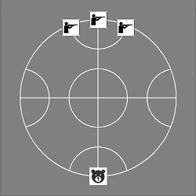

### Final positions ###

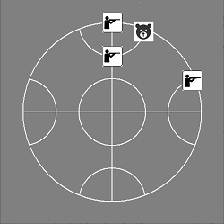 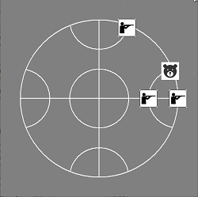 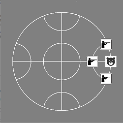

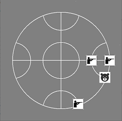 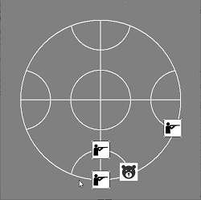 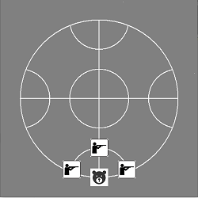

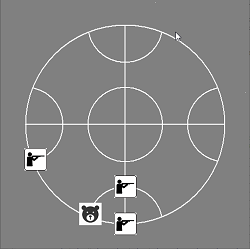 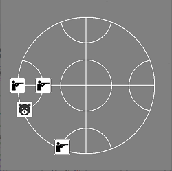 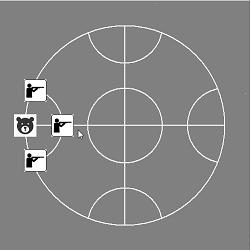

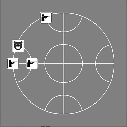 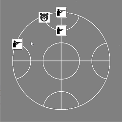 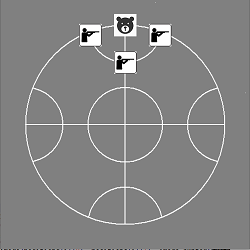

### Board ###

* The board is a circle with an inner circle inside and four semicircles, one for each quarter, all divided by two perpendicular lines.
* Each intersection is a position for players

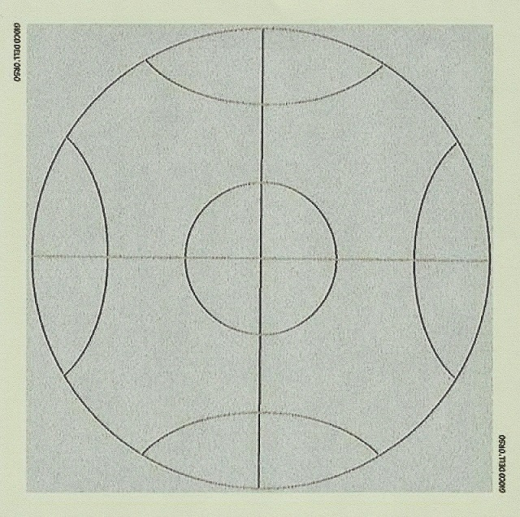

## Steps of the project ##

* Language: Python

### Steps on design

* Procedural _- DONE_
* OO _- DONE_

### Steps on UI ###

* Text _- DONE_
* Graphical with Tkinter _- DONE_

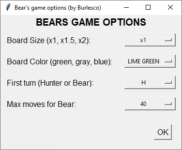
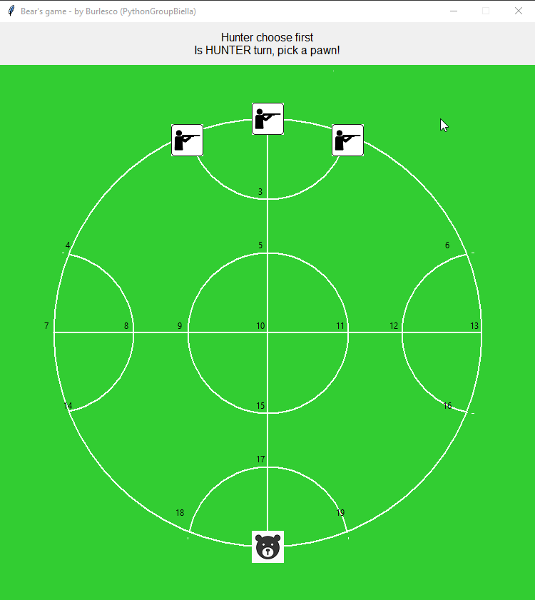
* Graphical with PyGame _- DONE_ (Game labels and comments in Italian)

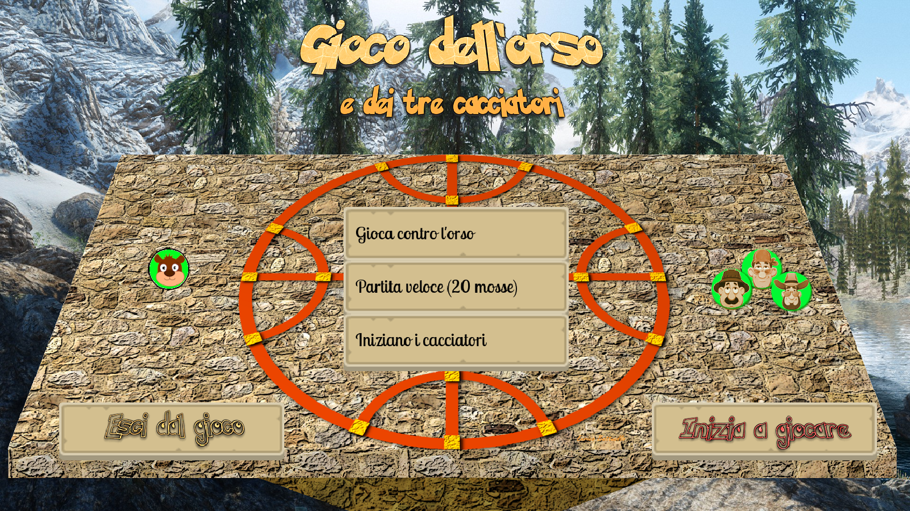
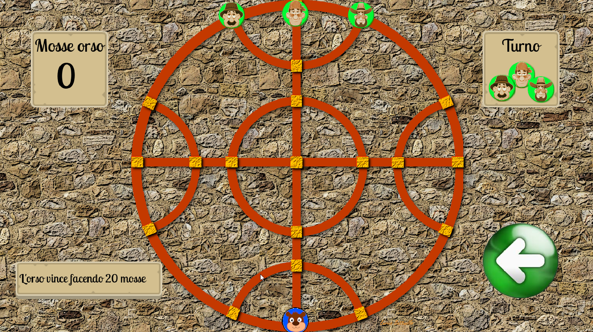
* Graphical with PyGame and Bear AI _- DONE with main contribution of Angelo Huang (Flecart)_ (Game labels and comments in Italian)

Thanks for PyGame lessons to Michele Pugno.

Thanks for the assets in PyGame version to Stefano Gunella and Enrico Battuello.

Thanks for Bear and Hunters AI implementation to Angelo Huang (Flecart).

Music "Games Worldbeat" by Bernardo R. from http://freesound.org

### Steps on game ###

* Human vs Human _- DONE_
* Human vs Bot (AI) _- DONE_
* Deployed as Web App _- DONE_
